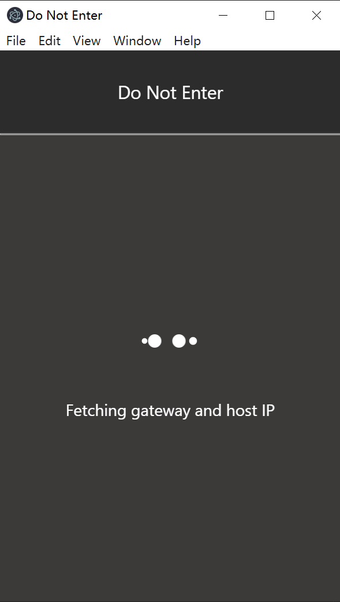
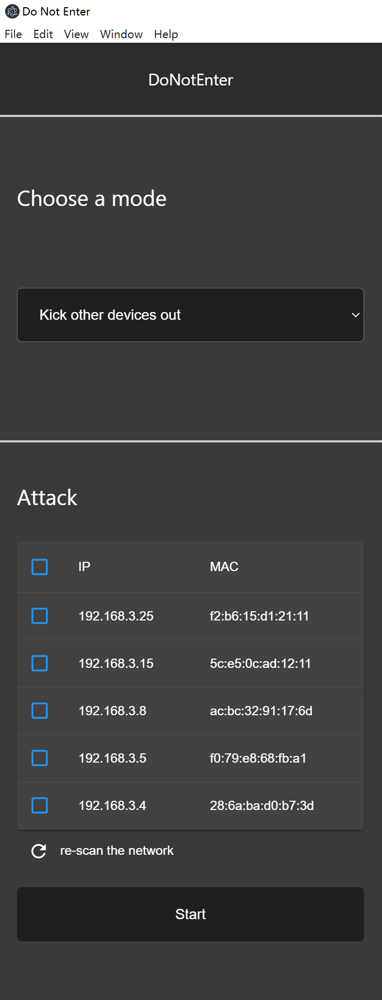

# About this project

The goal of this project is to provide an easy to use and cross-platform application which allows users to influence other devices’ network connection in the same WLAN/LAN. The functionality of this application is backed by ARP poisoning. The application will provide three modes:

- Kick other devices out:white_check_mark:: prevent other devices from accessing the WLAN/LAN.
- Speed limit:construction:: Reduce other devices’ network access speed. This is achieved by routing other devices' packets through your device, and selectively or randomly dropping certain portions of packets. (:warning:This mode is only avaliable on linux)
- Advanced:white_check_mark:: route other devices’ packets through your device, such that you can monitor other devices’ network activity.

# Setup the development environment

`node.js`, `python3.x` and `npm` is required to run this project in the development environment.
After clone the project, please use the following command to download dependencies.

```bash
npm install
```

# Run the project

Currently the project can only be ran in the development environment. A packaged application will be avaliable in the near future.
Start the local server using

```bash
npm run start
```

## Issues

### xxx was compiled against a different Node.js version using NODE_MODULE_VERSION xxx

You need to run electron-rebulid after the installation.

For windows:

```
.\node_modules\.bin\electron-rebuild.cmd
```

For linux/macOS:

```
$(npm bin)/electron-rebuild
```

Then start the application using

```bash
npm run electron
```

### module did not self-register

You need to remove all installed node_modules and then re-install them:

```
rm -r node_modules
npm install
```

# Screenshots

- Loading Screen



- Main page



# Credits

Libraries being used in this project

- electron
- network
- ping
- react
- react-dom
- react-scripts
- sudo-prompt
- web-vitals
